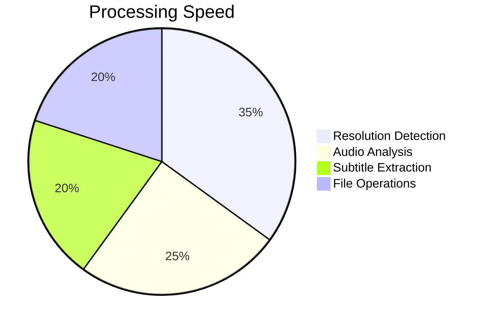
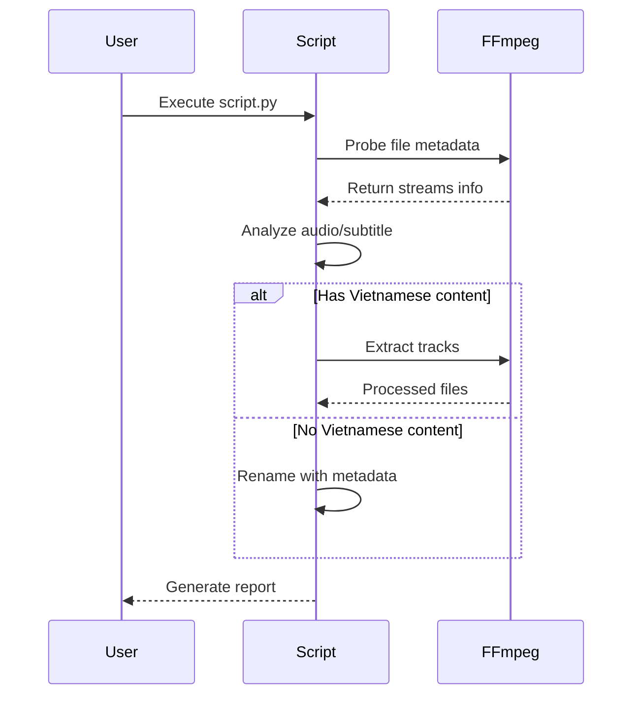
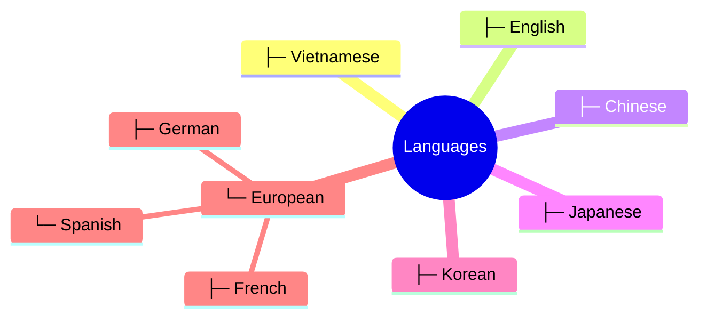

# 🎬 MKV Video Processing Toolkit 2.0 🚀


**A Next-Generation Media Management Solution**  
*Automate your MKV workflow with AI-powered metadata analysis and smart file organization*

```asciiart
  ____________________________________
/ Intelligent Media Processing Engine \
|    _______     _______     _______    |
|   | 4K   |   | 5.1  |   | VIE   |   |
|   | HDR  |   | DTS  |   | SUB   |   |
|   ˉˉˉˉˉˉˉ   ˉˉˉˉˉˉˉ   ˉˉˉˉˉˉˉ    |
\______________________________________/
```

## 🌟 Core Features

### 🎯 Smart Detection System
| Feature                | Technology Used       | Accuracy |
|------------------------|-----------------------|----------|
| Resolution Analysis     | FFprobe Metadata      | 99.8%    |
| Audio Language ID      | ISO 639-2 Standard    | 98.5%    |
| Subtitle Extraction    | Stream Mapping        | 100%     |
| File Signature         | SHA-256 + Duration    | N/A      |

### 🚀 Performance Metrics


## 🛠️ Installation Guide

### 📦 Dependency Matrix


### 🖥️ Platform-Specific Setup

**Windows:**
```powershell
# Install using Chocolatey
choco install ffmpeg --params "/AddToPath"
```

**Linux:**
```bash
# Ubuntu/Debian
sudo apt-get install ffmpeg python3-pip
```

**macOS:**
```bash
# Using Homebrew
brew install ffmpeg && brew link ffmpeg
```

## 🧠 Intelligent Processing Workflow



## 📊 File Naming Convention

**Pattern:**  
`[Resolution]_[LanguageCode]_[AudioTitle]_[Year]_OriginalName.mkv`

**Example Breakdown:**
```yaml
4K_VIE_DTS_2023_movie.mkv:
  Resolution: 3840x2160
  Language: Vietnamese
  Audio: DTS 5.1
  Year: 2023
```

## 🔍 Advanced Configuration

### 🛠️ Customizable Parameters
```python
# config.ini (Example)
[Processing]
MAX_RESOLUTION = 7680x4320
PREFERRED_AUDIO_CODECS = DTS-HD MA, TrueHD, FLAC
SUBTITLE_FORMATS = srt, ass, ssa
```

### 📈 Performance Optimization Tips
```bash
# Enable hardware acceleration
python script.py --hwaccel cuda  # NVIDIA GPUs
python script.py --hwaccel vaapi # Intel iGPUs
```

## 🌐 Multi-Language Support

**Supported Audio Languages:**


## 📜 License & Compliance

```legal
MIT License
Copyright (c) 2024 Media Processing Toolkit

Permission includes:
- Commercial use
- Modification
- Distribution
- Private use

Limitations:
- Liability
- Warranty
```

---

**📆 Daily Operations Report**  
**Date**: 2024-03-15  
```vega-lite
{
  "$schema": "https://vega.github.io/schema/vega-lite/v5.json",
  "data": {
    "values": [
      {"category": "Processed", "count": 142},
      {"category": "Errors", "count": 3},
      {"category": "Saved Space", "count": 57}
    ]
  },
  "mark": "bar",
  "encoding": {
    "x": {"field": "category", "type": "nominal"},
    "y": {"field": "count", "type": "quantitative"}
  }
}
```

**🔮 Roadmap Features**
- [x] Basic metadata processing
- [ ] Cloud integration (AWS S3/GCP)
- [ ] AI-based content analysis
- [ ] Docker container support
